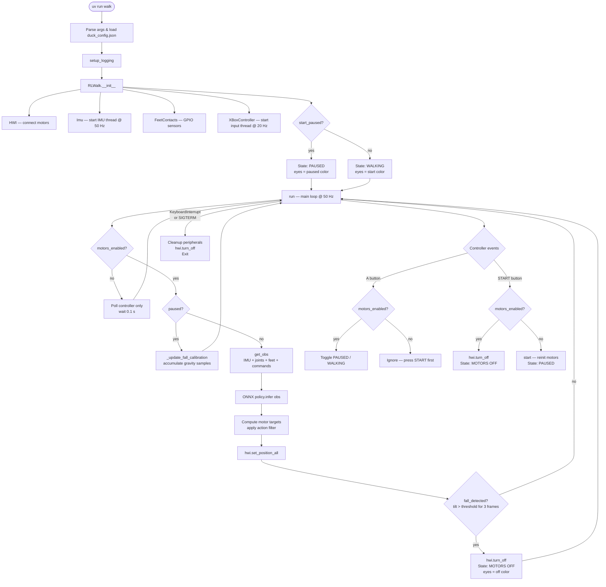

# Open Duck Mini Runtime

Runtime software for the [Open Duck Mini](https://github.com/apirrone/Open_Duck_Mini) – a small, open-source robotic duck that walks using a reinforcement-learning policy.

---

## Table of Contents

- [Quick Start](#quick-start)
- [Raspberry Pi Setup](#raspberry-pi-setup)
  - [Install Raspberry Pi OS](#install-raspberry-pi-os)
  - [Setup SSH](#setup-ssh)
  - [System Updates and Dependencies](#system-updates-and-dependencies)
  - [Enable I2C](#enable-i2c)
  - [Set the USB Serial Latency Timer](#set-the-usb-serial-latency-timer)
  - [Motor Control Board udev Rules](#motor-control-board-udev-rules)
- [Install the Runtime](#install-the-runtime)
- [Configuration](#configuration)
  - [duck_config.json Reference](#duck_configjson-reference)
  - [Controller Types](#controller-types)
  - [Generic USB Controller Mapping](#generic-usb-controller-mapping)
- [Hardware Configuration](#hardware-configuration)
  - [Speaker Wiring](#speaker-wiring)
- [Testing and Calibration](#testing-and-calibration)
  - [Test the IMU](#test-the-imu)
  - [Find Joint Offsets](#find-joint-offsets)
- [Running the Duck](#running-the-duck)
  - [Gamepad Walking](#gamepad-walking)
  - [SSH Keyboard Walking](#ssh-keyboard-walking)
- [Controls Reference](#controls-reference)
  - [Xbox / DualSense Controls](#xbox--dualsense-controls)
  - [Keyboard Controls (SSH)](#keyboard-controls-ssh)
- [Code Structure](#code-structure)
- [System Flow](#system-flow)
- [Running Tests](#running-tests)

---

## Quick Start

```bash
# 1. Install uv (if not already installed)
curl -LsSf https://astral.sh/uv/install.sh | sh

# 2. Clone and enter the repo
git clone https://github.com/apirrone/Open_Duck_Mini_Runtime
cd Open_Duck_Mini_Runtime

# 3. Install all dependencies into a managed virtual environment
uv sync

# 4. Walk!
uv run walk
```

---

## Raspberry Pi Setup

These instructions target a **Raspberry Pi Zero 2W** running Raspberry Pi OS Lite (64-bit).

### Install Raspberry Pi OS

1. Download [Raspberry Pi OS Lite (64-bit)](https://www.raspberrypi.com/software/operating-systems/).
2. Flash it with the [Raspberry Pi Imager](https://www.raspberrypi.com/documentation/computers/getting-started.html).
3. In the Imager's advanced options, pre-configure your username, Wi-Fi, and SSH key.

> **Tip:** Configure Wi-Fi to connect to your phone's hotspot for easy field access.

### Setup SSH

If SSH was not enabled during imaging, connect a screen and keyboard, then:

1. Connect to a Wi-Fi network.
2. Enable SSH: [Raspberry Pi SSH guide](https://www.raspberrypi.com/documentation/computers/configuration.html#setting-up-wifi).

### System Updates and Dependencies

```bash
sudo apt update && sudo apt upgrade -y
sudo apt install -y git curl

# Install uv
curl -LsSf https://astral.sh/uv/install.sh | sh

# Optional: camera support
sudo apt install -y python3-picamzero
```

### Enable I2C

```bash
sudo raspi-config
# Interface Options → I2C → Enable
```

### Set the USB Serial Latency Timer

```bash
sudo nano /etc/udev/rules.d/99-usb-serial.rules
```

Add:
```
SUBSYSTEM=="usb-serial", DRIVER=="ftdi_sio", ATTR{latency_timer}="1"
```

### Motor Control Board udev Rules

*(TODO)*

---

## Install the Runtime

```bash
git clone https://github.com/apirrone/Open_Duck_Mini_Runtime
cd Open_Duck_Mini_Runtime
uv sync
```

**Raspberry Pi 5 only** — replace the GPIO library after sync:
```bash
uv pip uninstall RPi.GPIO
uv pip install lgpio
```

---

## Configuration

### duck_config.json Reference

Copy the example config to your home directory:
```bash
cp example_config.json ~/duck_config.json
```

| Field | Type | Default | Description |
|---|---|---|---|
| `start_paused` | bool | `false` | Start the walk loop paused — press **A** to begin walking |
| `imu_upside_down` | bool | `false` | Flip IMU orientation for inverted mounting |
| `phase_frequency_factor_offset` | float | `0.0` | Offset added to the gait phase frequency |
| `log_level` | string | `"INFO"` | Logging verbosity: `TRACE`, `DEBUG`, `INFO`, `WARNING`, `ERROR` |
| `fall_detection` | bool | `true` | Enable automatic motor cut-off on detected fall |
| `fall_threshold_deg` | float | `45.0` | Tilt angle (degrees) that triggers fall detection |
| `eye_colors.start` | `[R,G,B]` or string | `[255,255,255]` | Eye color when walking/unpaused |
| `eye_colors.paused` | `[R,G,B]` or string | `[255,105,180]` | Eye color when paused (motors on) |
| `eye_colors.off` | `[R,G,B]` or string | `[255,0,0]` | Eye color when motors are disabled |
| `controller_type` | string | `"xbox"` | Which controller to use — see [Controller Types](#controller-types) |
| `expression_features.eyes` | bool | `false` | Enable NeoPixel eye LEDs |
| `expression_features.projector` | bool | `false` | Enable NeoPixel projector LED |
| `expression_features.sounds` | bool | `false` | Enable audio playback |
| `expression_features.antennas` | bool | `false` | Enable servo-driven antennas |
| `joints_offsets` | object | all `0.0` | Per-joint offset corrections (radians) |

### Controller Types

Set `"controller_type"` in `~/duck_config.json` to one of:

| Value | Description |
|---|---|
| `"xbox"` | Xbox One / Xbox Series controller via Bluetooth |
| `"dualsense"` | PlayStation 5 DualSense controller via Bluetooth or USB |
| `"generic_usb"` | Any SDL2-compatible USB gamepad with a configurable axis/button map |
| `"keyboard"` | WASD keyboard input via raw stdin — ideal for SSH sessions |

### Generic USB Controller Mapping

When using `"controller_type": "generic_usb"`, add an optional `generic_usb_controller` block to your config (defaults shown):

```json
{
  "controller_type": "generic_usb",
  "generic_usb_controller": {
    "joystick_index": 0,
    "axis_map": {
      "left_x": 0,
      "left_y": 1,
      "right_x": 2,
      "right_y": 3,
      "left_trigger": 4,
      "right_trigger": 5
    },
    "button_map": {
      "A": 0,
      "B": 1,
      "X": 2,
      "Y": 3,
      "LB": 4,
      "RB": 5
    }
  }
}
```

---

## Hardware Configuration

### Speaker Wiring

Follow the [Adafruit MAX98357 I2S Class-D Mono Amp](https://learn.adafruit.com/adafruit-max98357-i2s-class-d-mono-amp?view=all) tutorial for wiring.

> **Note:** Do **not** activate `/dev/zero` when prompted by the tutorial.

---

## Testing and Calibration

### Test the IMU

```bash
# Quick sanity check
python3 src/open_duck_mini_runtime/hardware/raw_imu.py

# Visualise IMU data (server on robot, client on your machine)
python3 dev/hardware/imu_server.py                   # on the robot
python3 dev/hardware/imu_client.py --ip <robot_ip>   # on your machine
```

Use `ifconfig` on the robot to find its IP address.

### Find Joint Offsets

This script guides you through finding the correct resting-position offsets for each servo. Add the reported values to `~/duck_config.json` under `joints_offsets`.

```bash
python3 tools/find_soft_offsets.py
```

> **Note:** This step will eventually be replaced by flashing offsets into each motor's EEPROM.

---

## Running the Duck

### Gamepad Walking

Use an Xbox One, Xbox Series, or DualSense controller paired over Bluetooth (or DualSense via USB).

```bash
uv run walk                           # uses ~/duck_config.json
uv run walk --help                    # show all options
uv run walk --onnx_model_path /path/to/model.onnx
uv run walk --log-level DEBUG         # verbose logging (overrides config)
```

**Xbox One Controller Bluetooth Pairing**

1. Long-press the sync button on the controller to enter pairing mode.
2. On the Pi:
   ```bash
   bluetoothctl
   scan on
   # wait for your controller MAC to appear, then:
   pair    <MAC>
   trust   <MAC>
   connect <MAC>
   ```

### SSH Keyboard Walking

Walk the duck entirely over SSH — no Bluetooth controller required.

```bash
uv run walk-keyboard                  # uses ~/duck_config.json
uv run walk-keyboard --help           # show all options
```

The terminal switches to raw mode while running. Press **Space** to pause, **Ctrl-C** to quit.

---

## Controls Reference

### Xbox / DualSense Controls

| Input | Action |
|---|---|
| **Left stick** | Forward / Back / Strafe |
| **Right stick X** | Turn left / right |
| **LB (hold)** | Sprint (increase walk frequency) |
| **D-pad up / down** | Increase / decrease phase frequency offset |
| **A** | Pause / Unpause walking |
| **START** | Toggle motors on/off (re-enables in paused state; press A to walk) |
| **X** | Toggle projector |
| **B** | Play a random sound |
| **Y** | Toggle head control *(experimental)* |
| **Left trigger** | Left antenna |
| **Right trigger** | Right antenna |

### Keyboard Controls (SSH)

| Key | Action |
|---|---|
| **W / S** | Forward / Backward |
| **A / D** | Turn left / Turn right |
| **Q / E** | Strafe left / Strafe right |
| **L (hold)** | Sprint (increase walk frequency) |
| **Space** | Pause / Unpause |
| **X** | Toggle projector |
| **B** | Play a random sound |
| **P** | Toggle head control *(experimental)* |

---

## Code Structure

The package is organised into three submodules plus shared top-level utilities:

```
src/open_duck_mini_runtime/
│
├── duck_config.py          # Config loading (shared by all submodules)
├── log.py                  # Logging setup + custom TRACE level
│
├── hardware/               # Physical hardware drivers
│   ├── hwi.py              #   Motor hardware interface (Feetech servos)
│   ├── raw_imu.py          #   BNO055 IMU — gyro, accelerometer, gravity
│   ├── imu.py              #   BNO055 IMU — quaternion/Euler mode
│   ├── feet_contacts.py    #   GPIO foot contact sensors
│   ├── eyes.py             #   NeoPixel eye LEDs with blink thread
│   ├── led_controller.py   #   Low-level NeoPixel controller
│   ├── projector.py        #   NeoPixel projector LED
│   ├── antennas.py         #   PWM servo antennas
│   ├── sounds.py           #   Audio playback (pygame mixer)
│   └── camera.py           #   Camera capture
│
├── controller/             # Gamepad / keyboard input
│   ├── xbox_controller.py  #   Xbox / generic pygame joystick
│   └── buttons.py          #   Button debounce state machine
│
└── rl_walk/                # RL policy and main walk loop
    ├── walk.py             #   RLWalk — main 50 Hz control loop
    ├── onnx_infer.py       #   ONNX model inference wrapper
    ├── poly_reference_motion.py  # Polynomial gait reference
    └── rl_utils.py         #   Action filters, coordinate helpers
```

---

## System Flow



---

## Running Tests

### Unit Tests (no hardware required)

```bash
uv run pytest
```

Covers duck_config parsing, button state machine, keyboard controller commands, controller dispatch, and RL utilities. No connected robot needed.

### Hardware Integration Tests

These tests require the duck to be plugged in and powered on (`/dev/ttyACM0`).

```bash
uv run pytest -m hardware
```

Runs `tests/test_servo_presence.py`, which polls each of the 14 servos individually and reports any that do not respond.

To explicitly exclude hardware tests during normal development:

```bash
uv run pytest -m "not hardware"
```

nix/pi-zero2w.nix — Uses raspberry-pi-02.base (BCM2710 / Pi Zero 2W silicon). Hostname duck-pi-zero2w.

nix/pi4.nix — Uses raspberry-pi-4.base + raspberry-pi-4.bluetooth. Hostname duck-pi4.

nix/pi5.nix — Uses raspberry-pi-5.base + raspberry-pi-5.page-size-16k. Hostname duck-pi5. Note: RPi.GPIO doesn't support Pi 5 kernel; uv pip install lgpio needed after first boot if using foot contact sensors.
